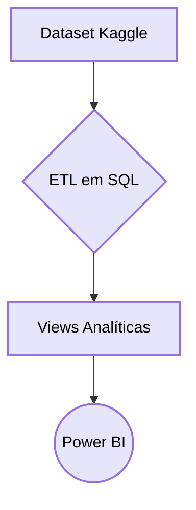

# 🔒 Análise de Ameaças Cibernéticas (2015–2024)

<br>

[](https://app.powerbi.com/links/TPsKYkUKGk?ctid=001ed149-d761-4dc5-9830-52a79f552e84&pbi_source=linkShare&bookmarkGuid=261a763b-92b7-4da2-aff4-fc70e0f16bc4)


Projeto de análise de dados sobre ameaças cibernéticas globais, com ETL em SQL e visualização no Power BI.
<br><br>


---

## 📋 Sumário

1. [🗂️ Estrutura do Projeto](#️-estrutura-do-projeto)
2. [🛠️ Pré-requisitos](#️-pré-requisitos)
3. [🚀 Como Executar](#️-como-executar)
4. [📊 Dataset](#️-dataset)
5. [📄 Documentação Técnica](#️-documentação-técnica)
6. [🤝 Contribuição](#️-contribuição)
7. [📜 Licença](#️-licença)
8. [✉️ Contato](#️-contato)

---

## 🗂️ Estrutura do Projeto
```plainttext
ciberseguranca/<br>
├── dataset/  
│   ├── scripts/              
│   │   ├── views/            
│   │   ├── 01_DataBase_Setup.sql  
│   │   ├── 02_ETL_import.sql  
│   │   └── 03_Views.sql  
│   │
│   ├── CyberSecurityAnalysis.pbix  
│   └── Threats.csv          
│
├── layout/                   
│   ├── Página 1.png  
│   ├── Página 2.png  
│   ├── Página 3.png  
│   └── tooltip.png
│   └── CyberSecurity.gif
│
├── Orientações/              
│   ├── Insight Simplificado para cada Setor.md 
│   └── Resumo do Projeto.md 
│
├── .gitignore               
└── README.md
```

## 🛠️ Pré-requisitos
- **SQL Server**
- **Power BI Desktop**: Versão 2.120+

<br>

## 🚀 Como Executar

### 🔹 Banco de Dados
Execute os scripts na ordem numérica:
```sql
-- 1. Criar estrutura
\i dataset/scripts/01_DataBase_Setup.sql

-- 2. Importar dados
\i dataset/scripts/02_ETL_import.sql

-- 3. Criar views analíticas
\i dataset/scripts/03_Views.sql
```

### 🔹 Power BI
* Abra dataset/CyberSecurityAnalysis.pbix

* Navegue para: Transformar Dados → Configurações da Fonte

* Atualize as conexões de dados

* Ajuste as visualizações conforme necessário
<br><br>

### 📊 Dataset
Fonte principal: 

* [Kaggle: **Global Cybersecurity Threats (2015–2024)**](https://www.kaggle.com/datasets/atharvasoundankar/global-cybersecurity-threats-2015-2024)
<br><br>

### 📄 Documentação Técnica
Inclui:

* Resumo do Projeto

* Insights pra cada setor
<br><br>

### 🔁 Fluxograma do ETL:



<br>

### 🤝 Contribuição
* Faça um fork do projeto

* Crie uma branch:
```sql
git checkout -b feature/nova-analise
```
Commit suas alterações:
```sql
git commit -m 'Adiciona análise X'
```
Push para sua branch:
```sql
git push origin feature/nova-analise
```
Abra um Pull Request
<br><br>
## 📜 Licença
Distribuído sob a licença MIT. Veja o arquivo LICENSE para mais informações.
<br><br>
## ✉️ Contato
 🤝 **Linkedin**: [/maraysamacedo](https://www.linkedin.com/in/maraysamacedo/)<br>
📧 **E-mail:** maraysa.macedo@outlook.com.br
